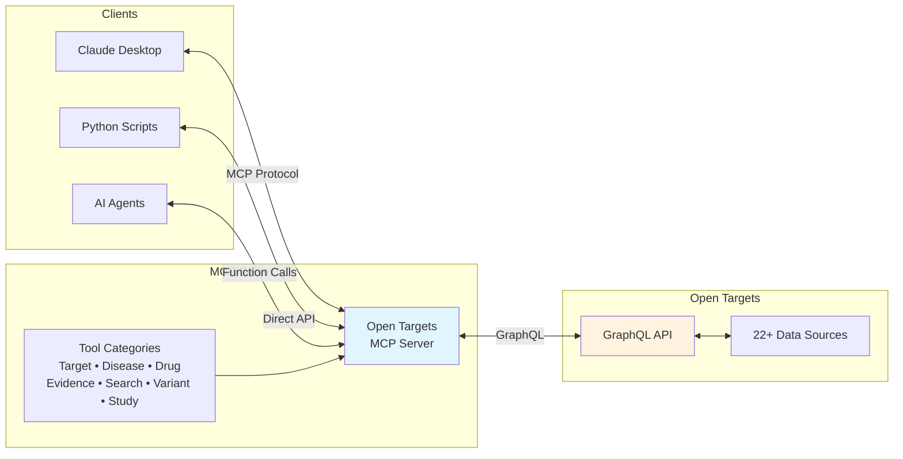

# Open Targets MCP Server

[](https://github.com/nickzren/opentargets-mcp/actions/workflows/ci.yml)
[](tests/)
[](https://www.python.org/)
[](https://github.com/modelcontextprotocol)
[](https://registry.modelcontextprotocol.io/v0/servers?search=nickzren/opentargets&version=latest)
[](https://platform.opentargets.org/)
[](README.md)
[](LICENSE)

A Model Context Protocol (MCP) server that exposes the Open Targets Platform GraphQL API as a set of tools for use with Claude Desktop and other MCP-compatible clients.

<!-- mcp-name: io.github.nickzren/opentargets -->

## Quick Install

### For Claude Desktop

#### Option 1: Using MCPM (Recommended)
```bash
# Install mcpm package manager
pip install mcpm

# Install the server
mcpm install opentargets
```

#### Option 2: Manual Setup
```bash
# Clone and setup
git clone https://github.com/nickzren/opentargets-mcp
cd opentargets-mcp
pip install uv
uv sync

# Import to Claude Desktop (stdio transport)
mcpm import stdio opentargets \
  --command "$(uv run which python)" \
  --args "-m opentargets_mcp.server --transport stdio"
```

Then restart Claude Desktop to start using the Open Targets tools.


### For Other MCP Clients

#### Option 1: Manual Setup
```bash
git clone https://github.com/nickzren/opentargets-mcp
cd opentargets-mcp
pip install uv
uv sync

# Option 1: Use the simple runner script (thin wrapper around uv run)
./run.sh

# Option 2: Run directly
uv run python -m opentargets_mcp.server
```
#### Option 2: Using Docker
```bash
git clone https://github.com/nickzren/opentargets-mcp
cd opentargets-mcp

# Build and run with Docker Compose
docker-compose up -d --build
```
Note: the default transport is `http` for docker deployments.

See the configuration section below for details and how to set ports and other environment variables.

## Features

### Core Capabilities

- **Target Analysis**: Search genes/proteins by Ensembl ID or symbol. Access expression data, genetic constraints, pathways, protein interactions, safety profiles, and mouse phenotypes
- **Disease Analysis**: Query diseases by EFO ID. Find associated targets, phenotypes (HPO), and research projects
- **Drug Discovery**: Search drugs by ChEMBL ID. Access safety data, adverse events, indications, and mechanism of action
- **Evidence Mining**: Explore target-disease associations with scored evidence from multiple sources
- **Variant Analysis**: Query genetic variants, GWAS credible sets, and pharmacogenomics data
- **Study Exploration**: Access GWAS studies with L2G predictions and fine-mapped loci
- **Smart Search**: Entity resolution with synonym handling, autocomplete, and ID mapping

### Data Sources

The Open Targets Platform integrates evidence from 22+ primary data sources:

- **Genetics**: Open Targets Genetics, ClinVar, UK Biobank, FinnGen, Gene2Phenotype, Orphanet, COSMIC
- **Functional**: CRISPR screens, DepMap, GeneBass
- **Drugs**: ChEMBL, FDA/EMA approvals, chemical probes
- **Expression**: GTEx, Human Protein Atlas, Expression Atlas
- **Pathways**: Reactome, Signor, IntAct
- **Literature**: Europe PMC text mining
- **Safety**: FAERS, pharmacogenomics data
- **Models**: Mouse (MGI, IMPC) phenotypes

## Architecture



The MCP server acts as a bridge between client applications and the Open Targets Platform. It translates tool calls into GraphQL queries and provides structured access to biomedical data from 22+ integrated sources.

## Prerequisites

- Python 3.12+ with pip

## Usage

### Running the Server Standalone
```bash
# Using the convenience script (automatically handles uv setup)
./run.sh

# Or run directly with uv (stdio transport by default)
uv run python -m opentargets_mcp.server

# Specify transport explicitly
uv run python -m opentargets_mcp.server --transport [stdio|sse|http]
```

### Configuration

- **Environment variables**: `MCP_TRANSPORT` (`stdio`, `sse`, or `http`), `FASTMCP_SERVER_HOST`, and `FASTMCP_SERVER_PORT` control the transport and bind address. Defaults are `stdio`, `0.0.0.0`, and `8000`. `OPEN_TARGETS_API_URL` can be set to use a custom Open Targets API endpoint. Default is set to the public API: `https://api.platform.opentargets.org/api/v4/graphql`.
- **Command line**: `opentargets-mcp --transport [stdio|sse|http] --host 0.0.0.0 --port 8000` provides flexible transport selection.
- **Verbose logging**: add `--verbose` to elevate the global log level to DEBUG when troubleshooting.

### Transport Modes

The server supports multiple transport protocols powered by FastMCP:

#### **stdio transport** (default)
```bash
# For Claude Desktop (via mcpm) and local CLI tools
opentargets-mcp --transport stdio
```

#### **SSE transport**
```bash
# For web-based MCP clients with Server-Sent Events
opentargets-mcp --transport sse --host 0.0.0.0 --port 8000
```

#### **HTTP transport**
```bash
# For streamable HTTP MCP clients
opentargets-mcp --transport http --host 0.0.0.0 --port 8000
```

### Using with MCP Clients

- **Claude Desktop**: Use mcpm installation (stdio) or direct server connection (sse)
- **Web MCP clients**: Use SSE or HTTP transports with public URL (tunnel required)
- **Custom integrations**: Any transport mode depending on your client implementation

### Example Scripts
```bash
uv run python examples/target_validation_profile.py EGFR
uv run python examples/disease_to_drug.py "schizophrenia"
uv run python examples/drug_safety_profile.py "osimertinib"
uv run python examples/genetic_target_prioritization.py "inflammatory bowel disease"
```

### AI Agent Example

The ReAct Agent provides an interactive terminal interface for exploring Open Targets data:


```bash
# Copy the example .env file and add your OpenAI API key
cp .env.example .env
# Then edit .env and set your OPENAI_API_KEY

# Run agent
uv run python examples/react_agent.py
```

The agent uses a ReAct (Reasoning and Acting) pattern to break down complex biomedical queries into steps, making it easy to explore drug targets, diseases, and their relationships.

## Available Tools

The server wraps **49** GraphQL operations from the [Open Targets Platform](https://platform-docs.opentargets.org/). Every tool returns structured JSON that mirrors the official schema, and you can inspect the full machine-readable list with the MCP `list_tools` request.

### Quick-start shortcuts
- `get_target_info` – Core target identity record (Ensembl IDs, synonyms, genomic coordinates)
- `get_disease_info` – Disease/EFO summary with therapeutic area context
- `get_drug_info` – ChEMBL-backed drug profile and mechanism data
- `search_entities` – Unified entity search with synonym handling
- `get_target_associated_diseases` – High-confidence target-disease links with scores
- `get_disease_associated_targets` – Prioritised target list for an EFO disease
- `get_target_known_drugs` – Approved and investigational agents for a target
- `get_target_disease_evidence` – Evidence details across genetics, expression, and literature

### Full catalog by category
- **Target identity & biology (20 tools)** — `get_target_info`, `get_target_class`, `get_target_alternative_genes`, `get_target_associated_diseases`, `get_target_known_drugs`, `get_target_literature_occurrences`, `get_target_expression`, `get_target_pathways_and_go_terms`, `get_target_homologues`, `get_target_subcellular_locations`, `get_target_genetic_constraint`, `get_target_mouse_phenotypes`, `get_target_hallmarks`, `get_target_depmap_essentiality`, `get_target_interactions`, `get_target_safety_information`, `get_target_tractability`, `get_target_chemical_probes`, `get_target_tep`, `get_target_prioritization`.
- **Disease analytics (4 tools)** — `get_disease_info`, `get_disease_associated_targets`, `get_disease_phenotypes`, `get_disease_otar_projects`.
- **Drug profiling (7 tools)** — `get_drug_info`, `get_drug_cross_references`, `get_drug_linked_diseases`, `get_drug_linked_targets`, `get_drug_adverse_events`, `get_drug_pharmacovigilance`, `get_drug_warnings`.
- **Evidence synthesis (2 tools)** — `get_target_disease_evidence`, `get_target_disease_biomarkers`.
- **Search & discovery (4 tools)** — `search_entities`, `search_suggestions`, `get_similar_targets`, `search_facets`.
- **Variant interpretation (6 tools)** — `get_variant_info`, `get_variant_credible_sets`, `get_variant_pharmacogenomics`, `get_variant_evidences`, `get_variant_intervals`, `get_variant_protein_coordinates`.
- **Study exploration (6 tools)** — `get_study_info`, `get_studies_by_disease`, `get_study_credible_sets`, `get_credible_set_by_id`, `get_credible_set_colocalisation`, `get_credible_sets`.

Each grouping matches the data domains described in the Open Targets docs (targets, diseases, drugs, evidence, variants, and studies). For high-volume workloads, respect the platform's throttling guidance from the official API FAQ and cache downstream where possible.

## Development

```bash
# Run tests
uv run pytest tests/ -v
```
