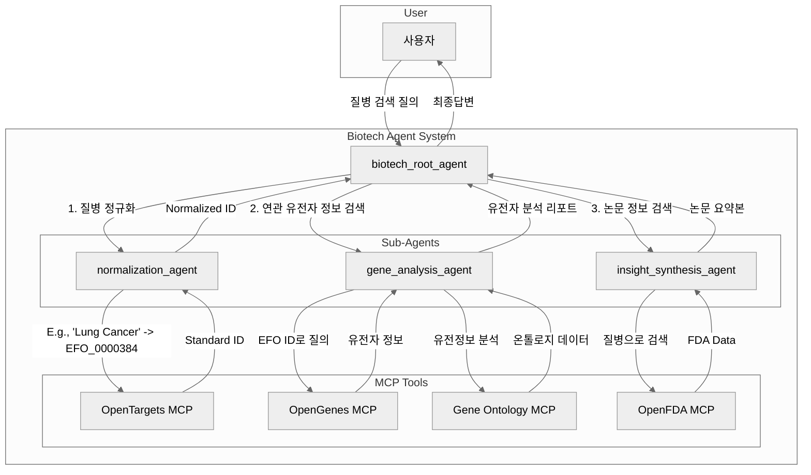

# Biotech Agent

## 배경 및 필요성

생명공학 및 의학 연구원은 최신 연구 동향을 파악하고 새로운 가설을 설정하기 위해 방대한 양의 데이터를 탐색해야 합니다. 유전자 정보, 질병과의 연관성, 임상시험 데이터, 약물 정보 등은 GeneOntology, OpenFDA, OpenGenes, OpenTargets 등 전 세계적으로 분산된 여러 전문 데이터베이스에 저장되어 있습니다.

하지만 이러한 데이터베이스들은 서로 다른 데이터 구조와 검색 방식을 가지고 있으며, 때로는 "폐암"과 같은 일상적인 용어 대신 `MONDO_0005027`과 같은 정규화된(Normalized) 식별자(ID)를 사용해야만 정확한 정보를 얻을 수 있습니다.

이로 인해 연구원들은 다음과 같은 어려움에 직면합니다.

*   **긴 검색 프로세스:** 여러 웹사이트를 일일이 방문하여 동일한 주제에 대해 반복적으로 검색해야 하는 번거로움이 있습니다.
*   **산재된 데이터:** 정보가 여러 데이터베이스에 분산되어 있어 전체적인 그림을 파악하기 어렵습니다.
*   **용어 정규화의 어려움:** 특정 데이터베이스에서 요구하는 정규화된 용어(예: 질병 ID, 유전자 ID)를 모르면 원하는 정보를 얻지 못하는 경우가 많습니다. 이로 인해 연구원은 각 데이터베이스의 사용법을 별도로 학습해야 하는 부담을 안게 됩니다.

## 기획 의도 및 해결할 수 있는 문제

**Biotech Agent**는 이러한 문제들을 해결하기 위해 개발되었습니다. 본 프로젝트는 여러 생명공학 데이터베이스를 하나로 묶는 통합 검색 레이어를 제공하는 지능형 에이전트를 구축하는 것을 목표로 합니다.

연구원이 자연어(Natural Language)로 질문을 하면, Biotech Agent는 다음과 같은 과정을 통해 복잡한 검색 프로세스를 자동화합니다.

1.  **의도 파악 및 용어 정규화:** 연구원의 질문(예: "폐암과 관련된 유전자는 무엇인가?")을 분석하여 핵심 키워드("폐암")를 추출하고, 이를 각 데이터베이스에서 사용하는 정규화된 식별자(ID)로 변환합니다.
2.  **분산된 데이터베이스 동시 검색:** 정규화된 식별자를 사용하여 GeneOntology, OpenTargets 등 연결된 모든 데이터베이스에 동시에 검색을 요청합니다.
3.  **결과 종합 및 인사이트 제공:** 각 데이터베이스로부터 수집된 정보를 종합하고, 연구원의 질문에 가장 적합한 형태로 가공하여 최종 결과를 제공합니다.

Biotech Agent를 통해 다음과 같은 문제를 해결하고 연구 환경을 개선할 수 있습니다.

*   **연구 생산성 향상:** 반복적이고 시간 소모적인 데이터 검색 작업을 자동화하여 연구원이 데이터 분석 및 가설 검증과 같은 핵심 연구 활동에 더 집중할 수 있도록 돕습니다.
*   **데이터 접근성 향상:** 개별 데이터베이스의 복잡한 사용법을 알지 못해도, 자연어 질문만으로 원하는 정보에 쉽게 접근할 수 있습니다.
*   **통합적 인사이트 도출:** 여러 데이터 소스에 분산된 정보를 한 번에 종합하여 보여줌으로써, 단일 데이터베이스만으로는 발견하기 어려웠던 새로운 관계나 패턴을 발견하고 더 깊이 있는 인사이트를 얻을 수 있도록 지원합니다.

Biotech Agent는 연구원들이 데이터의 장벽을 넘어 더 빠르고 효율적으로 위대한 발견을 할 수 있도록 돕는 강력한 조수가 될 것입니다.

## Architecture Diagram

